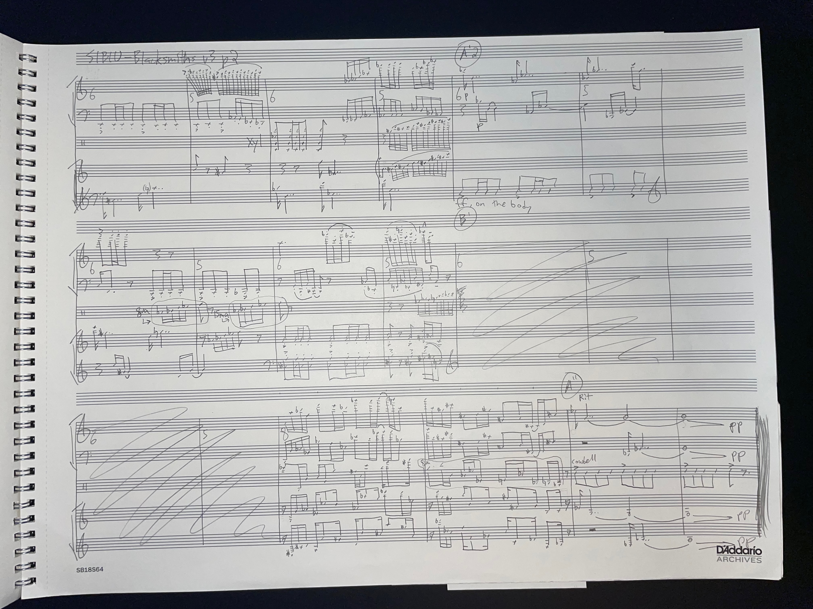
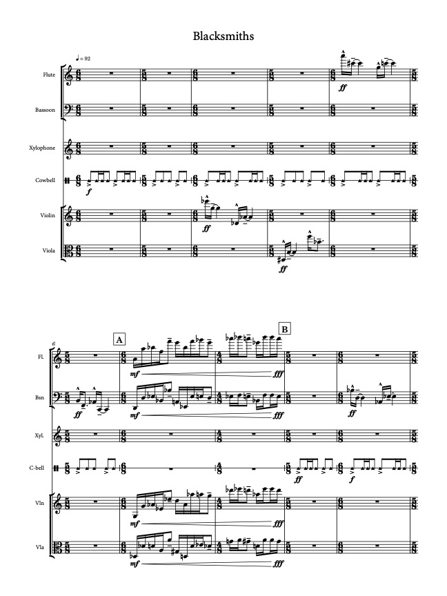
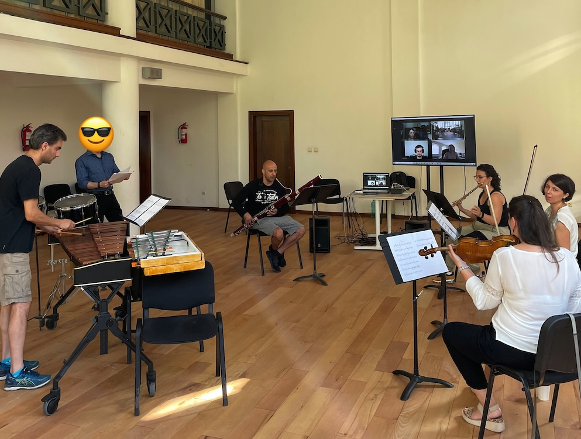
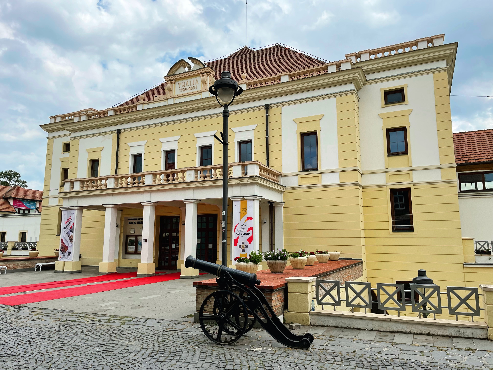
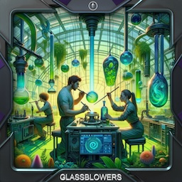
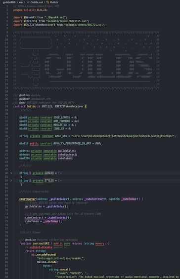

# GUILDS

An 8x8x8 musical hypercube, MELTABLE into 💙 512 audio-emotional moments

Composed with PAPER and PENCIL, for ICon Arts and the Sibiu Philharmonic

Inspired by the Medieval craft GUILDS of Sibiu, Transilvania, Romania

For CHAMBER QUINTET - flute, bassoon, viola, violin, percussion

Don't just 🔥 BURN your music NFTs.. ❤️‍🔥 MELT them

✨ GUILDS ✨

---

#### Table of Contents

1. [The Background](#the-background)
2. [The Music](#the-music)
3. [The Art](#the-art)
4. [The Code](#the-code)
5. [The Experience](#the-experience)

---

# The Background

- TODO

# The Music

- There are 8 GUILDS, each represented musically, from Blacksmiths to Candlemakers to Glassblowers and more
- The total piece is 8 movements, ~12 min long, for flute, bassoon, violin, viola, and mixed percussion
- For full score and/or parts, contact @neodaoist

### Paper and Pencil Draft

### Final Engraved Score

### Behind-the-scenes Rehearsal

### Morning of the Premiere (Thalia Hall, Sibiu, Romania)

### Premiere Performance

# The Art

- There are 8 art STYLES, from Cave Art to Solarpunk, Starry Night to Psychedelia
- There are 64 audio-emotional moments (8 guilds x 8 styles)
- Each an edition of 8, for a total of 512 moments (8x8x8)
- How can collectors MELT their common moment NFTs into rarer NFTs?
  - A collector with all 8 common STYLE moments of a Guild, can MELT into 1 uncommon 8x1 STYLE moment strip
  - A collector with all 8 common GUILD moments of a Style, can MELT into 1 uncommon 1x8 GUILD moment strip
  - A collector with all 64 audio-emotional moments, can MELT into 1 rare 8x8 MOSAIC moment sheet
  - A collector with all 512 audio-emotional moments, can MELT into the 1/1 ultrarare 8x8x8 CUBE

# The Code

- TODO
- MELTABLE mechanism is bidirectional — singles can be MELTED into composite, composite can be UNMELTED into singles

## The Experience

1. [x] MINT the initial 8x8x8 CUBE on Manifold [Manifold CUBE link]
2. [x] UNMELT the CUBE into 512 audio-emotional moments [BaseScan GUILDS contract link]
3. [x] MELT a few moment strips and mosaics [Zora ClassicalMusicFan.eth profile link]
4. [x] List the remaining moments for .000888 ETH [OpenSea GUILDS collection link]
5. [ ] Enjoy the MUSIC and ❤️‍🔥 MELT 🫠

## What's Next?

- The Music — TODO
- The Code — TODO
- The Art — TODO

---

GUILDS

Minted on the Superchain January 2024

MIT License 2024 |||| a Loudverse production |||| classical music for the 22nd century
