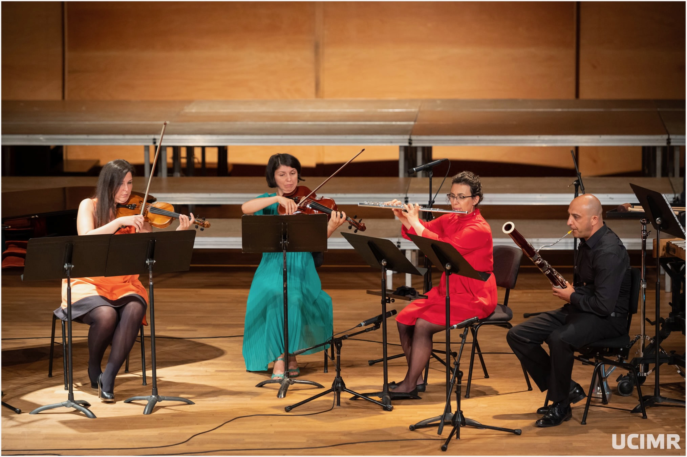
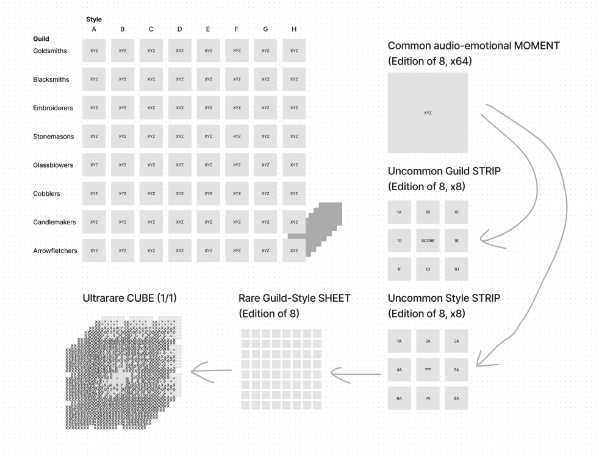

# GUILDS

An 8x8x8 musical hypercube, MELTABLE into 💙 512 audio-emotional moments

Composed with PAPER and PENCIL, for ICon Arts and the Sibiu Philharmonic

Inspired by the Medieval craft GUILDS of Sibiu, Transilvania, Romania

For CHAMBER QUINTET - flute, bassoon, violin, viola, percussion

Don't just 🔥 BURN your music NFTs.. ❤️‍🔥 MELT them

✨ GUILDS ✨

---

#### Table of Contents

1. [The Background](#the-background)
2. [The Music](#the-music)
3. [The Art](#the-art)
4. [The Code](#the-code)
5. [The Experience](#the-experience)

---

# The Background

- Sibiu was founded in Transilvania by Saxon settlers, during the mid–late 12th century
- By the 14th century it was already an important trade center, with craftspeople divided into 40 guilds
- Like other Transilvanian cities then, the citadel walls were lined with towers, each maintained by a guild
- This piece is inspired by that rich history, employing a musical language to evoke the essence of each guild
- While the guilds of tomorrow may be Frontend or Contracts, Growth or Community, Data or Deep Learning — craftsmanship will always matter

### A Sibiu Guild Tower

### Sibiu's House of the Journeymen

### A Modern-day Carpenter at Work in Sibiu

# The Music

- There are 8 GUILDS, each represented musically, from Blacksmiths to Candlemakers, Glassblowers, and more
- The piece is 8 movements, ~12 minutes long, for flute, bassoon, violin, viola, and mixed percussion
- In the [full version](https://gallery.manifold.xyz/base/0x4db3ab8e606eadf3d94cf5349a35c415156b89b3/1), between movements there is a "promenade" motif on tubular bells, spelling out SI-B-I-U (this idea came to my composition teacher in a dream ✨)
- Music by Neodaoist; for full score and/or parts, contact [@neodaoist](https://twitter.com/neodaoist)
- Listen to the music of GUILDS! Which is your favorite movement?
  - [GOLDSMITHS](https://opensea.io/assets/base/0xe09cd75b2e3a874f08fb8d09a98bdea307a1ff92/9)
  - [BLACKSMITHS](https://opensea.io/assets/base/0xe09cd75b2e3a874f08fb8d09a98bdea307a1ff92/50)
  - [EMBROIDERERS](https://opensea.io/assets/base/0xe09cd75b2e3a874f08fb8d09a98bdea307a1ff92/35)
  - [STONEMASONS](https://opensea.io/assets/base/0xe09cd75b2e3a874f08fb8d09a98bdea307a1ff92/4)
  - [GLASSBLOWERS](https://opensea.io/assets/base/0xe09cd75b2e3a874f08fb8d09a98bdea307a1ff92/21)
  - [COBBLERS](https://opensea.io/assets/base/0xe09cd75b2e3a874f08fb8d09a98bdea307a1ff92/30)
  - [CANDLEMAKERS](https://opensea.io/assets/base/0xe09cd75b2e3a874f08fb8d09a98bdea307a1ff92/47)
  - [ARROWFLETCHERS](https://opensea.io/assets/base/0xe09cd75b2e3a874f08fb8d09a98bdea307a1ff92/64)

### Paper and Pencil Draft

### Final Engraved Score

### Sibiu Promenade Motif

### Behind-the-scenes Rehearsal

### Morning of the Premiere (Thalia Hall, Sibiu, Romania)

### Premiere Performance

# The Art

- There are 8 art STYLES, from Cave Art to Solarpunk, Starry Night to Psychedelia
- There are 64 audio-emotional moments (8 guilds x 8 styles)
- Each an edition of 8, for a total of 512 moments (8x8x8)
- How can collectors MELT their common moment NFTs into rarer NFTs?
  - A collector with all 8 style moments of a guild, can MELT into an [uncommon 1x8 GUILD moment strip](https://opensea.io/assets/base/0xe09cd75b2e3a874f08fb8d09a98bdea307a1ff92/73)
  - A collector with all 8 guild moments of a style, can MELT into an [uncommon 8x1 STYLE moment strip](https://opensea.io/assets/base/0xe09cd75b2e3a874f08fb8d09a98bdea307a1ff92/66)
  - A collector with all 64 audio-emotional moments, can MELT into a [rare 8x8 MOSAIC moment sheet](https://opensea.io/assets/base/0xe09cd75b2e3a874f08fb8d09a98bdea307a1ff92/81)
  - A collector with all 512 audio-emotional moments, can MELT into the [1/1 ultrarare 8x8x8 CUBE](https://gallery.manifold.xyz/base/0x4db3ab8e606eadf3d94cf5349a35c415156b89b3/1)
- 2D art prompted by Neodaoist; 3D art modeled by digital collaborator (literally paid with OP airdrop earnings!)

### Some Examples of the Art

# The Code

- The [initial CUBE contract](https://basescan.org/address/0x4db3ab8e606eadf3d94cf5349a35c415156b89b3?a=1#code) is an ERC721, created with Manifold Studio on Base
- The [meltable GUILDS contract](https://basescan.org/address/0xe09cd75b2e3a874f08fb8d09a98bdea307a1ff92#code) is an ERC1155, written with Foundry and Solmate
- MELTABLE mechanism is bidirectional —
  - Singles can be MELTED into compounds
  - Compounds can be UNMELTED into singles
- Code by Neodaoist; for more details, check out the [test suite](./test/Guilds.t.sol)

### The GUILDS ERC1155 NFT Contract

### Designing the Meltable Mechanism

### One of the Eight Meltable Functions

## The Experience

1. [x] Deploy the contract and MINT the 8x8x8 CUBE with [Manifold](https://gallery.manifold.xyz/base/0x4db3ab8e606eadf3d94cf5349a35c415156b89b3/1)
2. [x] UNMELT the CUBE into [512 audio-emotional moments](https://basescan.org/tx/0x01a9df31ac13b0317af88fb403ea94940b0d2d2f951dca3d65633c781c5a37c1)
3. [x] MELT a few moment strips and mosaics ([scroll to bottom to see rares =)](https://zora.co/0x4ab68ce2dd8dbdd17f925b5ab49e6f7ad433013b))
4. [x] List the remaining moments [for sale for .000888 ETH!](https://opensea.io/collection/guilds888)
5. [ ] Enjoy the MUSIC and ❤️‍🔥 MELT 🫠

## What's Next for GUILDS?

- The Music — 🎻 Would love to re-record the expanded version, again with [ICon Arts Ensemble](https://iconartsfestival.com/)
- The Code — ⛽️ Definitely some opportunities to gas golf and optimize the contract further
- The Art — ⏳ Could add a time dimension, where the art unfolds and evolves over time
- The Experience — 💻 Develop a frontend, because right now melting is done by interacting directly with the contract, eg using [BaseScan](https://basescan.org/), [op-viem](https://www.opviem.sh/), or [cast](https://book.getfoundry.sh/cast/)

---

W💙TA

Minted on the Superchain January 2024

MIT License 2024 |||| a Loudverse production |||| classical music for the 22nd century
